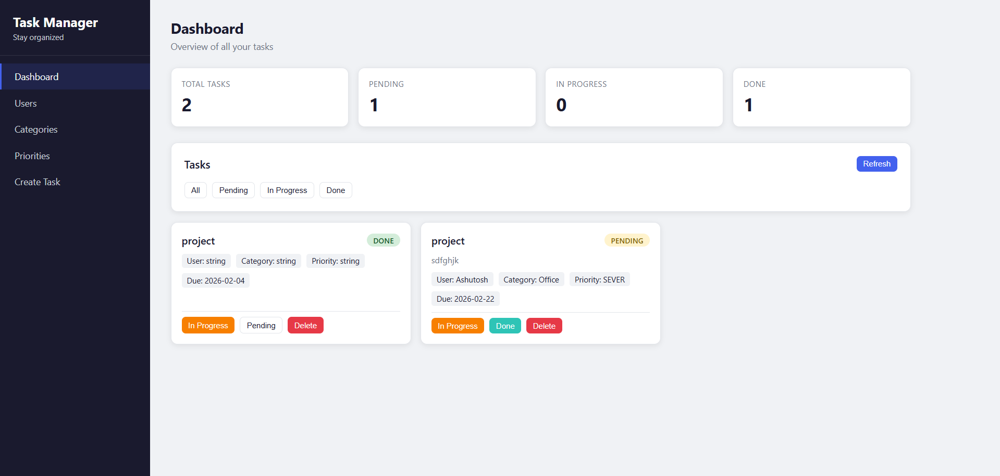
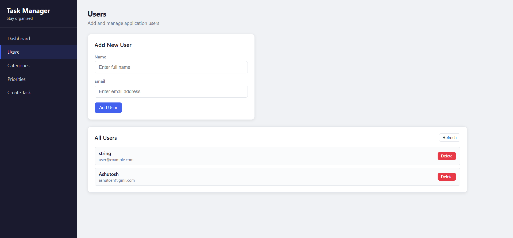
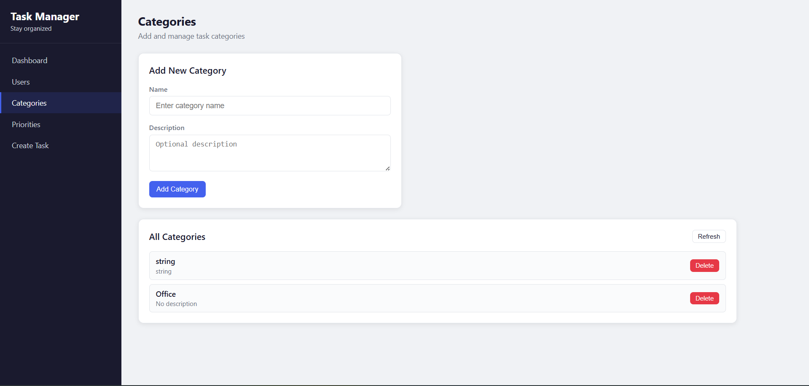
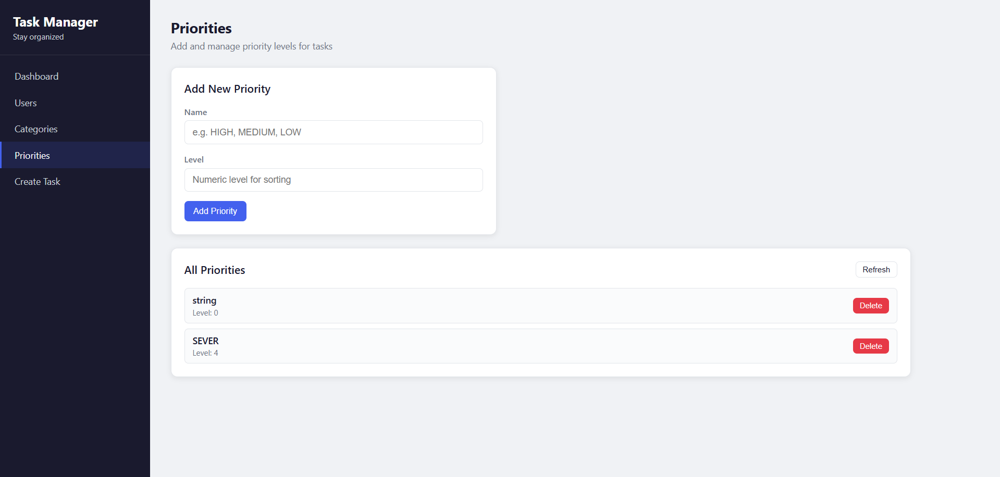

# Task Manager REST API — Spring Boot + PostgreSQL

## Project Overview

Task Manager REST API is a production-style Spring Boot backend application that provides a complete task management system for managing Users, Categories, Priorities, and Tasks through REST endpoints.

The project follows clean layered architecture and demonstrates real-world backend practices including DTO usage, validation, global exception handling, relational mapping, and Swagger documentation. It is suitable for academic major projects, internship evaluations, and backend portfolio demonstrations.

---

## Tech Stack

* Java 17+
* Spring Boot
* Spring Web
* Spring Data JPA (Hibernate)
* PostgreSQL
* Lombok
* Jakarta Validation
* Springdoc OpenAPI (Swagger UI)
* Maven

---

## Maven Dependencies Used

```xml
<!-- Spring Web -->
<dependency>
    <groupId>org.springframework.boot</groupId>
    <artifactId>spring-boot-starter-web</artifactId>
</dependency>

<!-- Spring Data JPA -->
<dependency>
    <groupId>org.springframework.boot</groupId>
    <artifactId>spring-boot-starter-data-jpa</artifactId>
</dependency>

<!-- PostgreSQL Driver -->
<dependency>
    <groupId>org.postgresql</groupId>
    <artifactId>postgresql</artifactId>
</dependency>

<!-- Lombok -->
<dependency>
    <groupId>org.projectlombok</groupId>
    <artifactId>lombok</artifactId>
    <optional>true</optional>
</dependency>

<!-- Validation -->
<dependency>
    <groupId>org.springframework.boot</groupId>
    <artifactId>spring-boot-starter-validation</artifactId>
</dependency>

<!-- Swagger / OpenAPI -->
<dependency>
    <groupId>org.springdoc</groupId>
    <artifactId>springdoc-openapi-starter-webmvc-ui</artifactId>
    <version>2.5.0</version>
</dependency>

<!-- DevTools (optional) -->
<dependency>
    <groupId>org.springframework.boot</groupId>
    <artifactId>spring-boot-devtools</artifactId>
    <scope>runtime</scope>
</dependency>
```

---

## Architecture

Layered architecture is used:

Controller → Service → Repository → Model → Database

* Controller: REST endpoints and request handling
* Service: Business logic and validation
* Repository: Database access layer
* Model: JPA entity classes
* DTO: Request payload objects
* Exception: Global error handling

---

## Complete Project Structure

```
taskmanager/
│
├── pom.xml
├── README.md
│
└── src/
    ├── main/
    │   ├── java/com/example/taskmanager/
    │   │
    │   │── TaskmanagerApplication.java
    │   │
    │   ├── controller/
    │   │   ├── UserController.java
    │   │   ├── CategoryController.java
    │   │   ├── PriorityController.java
    │   │   └── TaskController.java
    │   │
    │   ├── service/
    │   │   ├── UserService.java
    │   │   ├── CategoryService.java
    │   │   ├── PriorityService.java
    │   │   └── TaskService.java
    │   │
    │   ├── repository/
    │   │   ├── UserRepository.java
    │   │   ├── CategoryRepository.java
    │   │   ├── PriorityRepository.java
    │   │   └── TaskRepository.java
    │   │
    │   ├── model/
    │   │   ├── User.java
    │   │   ├── Category.java
    │   │   ├── Priority.java
    │   │   ├── Task.java
    │   │   └── TaskStatus.java
    │   │
    │   ├── dto/
    │   │   ├── CreateUserRequest.java
    │   │   ├── CreateCategoryRequest.java
    │   │   ├── CreatePriorityRequest.java
    │   │   ├── CreateTaskRequest.java
    │   │   └── UpdateTaskStatusRequest.java
    │   │
    │   └── exception/
    │       ├── ErrorResponse.java
    │       ├── GlobalExceptionHandler.java
    │       ├── UserNotFoundException.java
    │       ├── TaskNotFoundException.java
    │       ├── CategoryNotFoundException.java
    │       └── PriorityNotFoundException.java
    │   
    └── resources/
        ├── application.properties   (not committed — local only)
        └── static/
```

---

## Database Design

### Tables

* users
* categories
* priorities
* tasks

### Relationships

* One User → Many Tasks
* One Category → Many Tasks
* One Priority → Many Tasks
* Task contains foreign keys

---

## Database Schema (Logical)

### users

```
id           BIGSERIAL PRIMARY KEY
name         VARCHAR NOT NULL
email         VARCHAR UNIQUE NOT NULL
created_at   TIMESTAMP
```

### categories

```
id           BIGSERIAL PRIMARY KEY
name         VARCHAR UNIQUE NOT NULL
description  VARCHAR
```

### priorities

```
id           BIGSERIAL PRIMARY KEY
name         VARCHAR UNIQUE NOT NULL
level        INTEGER NOT NULL
```

### tasks

```
id            BIGSERIAL PRIMARY KEY
title         VARCHAR NOT NULL
description   TEXT
status        VARCHAR NOT NULL
due_date      DATE
created_at    TIMESTAMP
updated_at    TIMESTAMP

user_id       BIGINT REFERENCES users(id)
category_id   BIGINT REFERENCES categories(id)
priority_id   BIGINT REFERENCES priorities(id)
```

---

## Enum Used

TaskStatus stored as STRING:

```
PENDING
IN_PROGRESS
DONE
```

---

## application.properties (Local Only)

Create locally at:

```
src/main/resources/application.properties
```

```properties
server.port=8080

spring.datasource.url=jdbc:postgresql://localhost:5432/taskdb
spring.datasource.username=postgres
spring.datasource.password=YOUR_PASSWORD

spring.jpa.hibernate.ddl-auto=update
spring.jpa.show-sql=true
spring.jpa.properties.hibernate.format_sql=true
spring.jpa.database-platform=org.hibernate.dialect.PostgreSQLDialect

springdoc.swagger-ui.path=/swagger-ui.html
```

---

## Database Setup

```
CREATE DATABASE taskdb;
```

Tables auto-created by JPA.

---

## Run Instructions

```
mvn clean install
mvn spring-boot:run
```

---

## Swagger UI

```
http://localhost:8080/swagger-ui.html
```

---

## API Endpoints

### Users

POST /api/users
GET /api/users
GET /api/users/{id}
DELETE /api/users/{id}

---

### Categories

POST /api/categories
GET /api/categories
GET /api/categories/{id}
DELETE /api/categories/{id}

---

### Priorities

POST /api/priorities
GET /api/priorities
GET /api/priorities/{id}
DELETE /api/priorities/{id}

---

### Tasks

POST /api/tasks
GET /api/tasks
GET /api/tasks/{id}
PUT /api/tasks/{id}/status
DELETE /api/tasks/{id}

---

## Error Handling

Global handler returns structured error JSON with proper status codes.

* 400 — validation error
* 404 — resource not found
* 409 — duplicate data
* 500 — server error

---

## Testing Order

1. Create User
2. Create Category
3. Create Priority
4. Create Task
5. Update Task Status
6. Fetch Tasks

---

## Frontend UI 

A clean multi-page web UI is available under the Spring Boot static resources. Each feature has its own dedicated page.

### UI Screenshots

#### Dashboard



The dashboard shows task stats at the top (Total, Pending, In Progress, Done), filter buttons to view tasks by status, and task cards with inline status change and delete buttons.

#### Users Page



Add new users with name and email. All existing users are listed below with a delete button.

#### Categories Page



Create task categories with name and optional description. Existing categories are listed below.

#### Priorities Page



Add priority levels like HIGH, MEDIUM, LOW with a numeric level for sorting.

#### Create Task Page


Create a new task by filling in title, description, due date, and selecting user, category, and priority from dropdowns.


### File Structure

```
static/
  index.html          (Dashboard page)
  users.html          (Users page)
  categories.html     (Categories page)
  priorities.html     (Priorities page)
  tasks.html          (Create Task page)
  css/
    app.css           (Shared styles)
  js/
    api.js            (Shared API helper functions)
    dashboard.js      (Dashboard page logic)
    users.js          (Users page logic)
    categories.js     (Categories page logic)
    priorities.js     (Priorities page logic)
    tasks.js          (Create Task page logic)
```

Run the application and open `http://localhost:8080/` in your browser.

---
